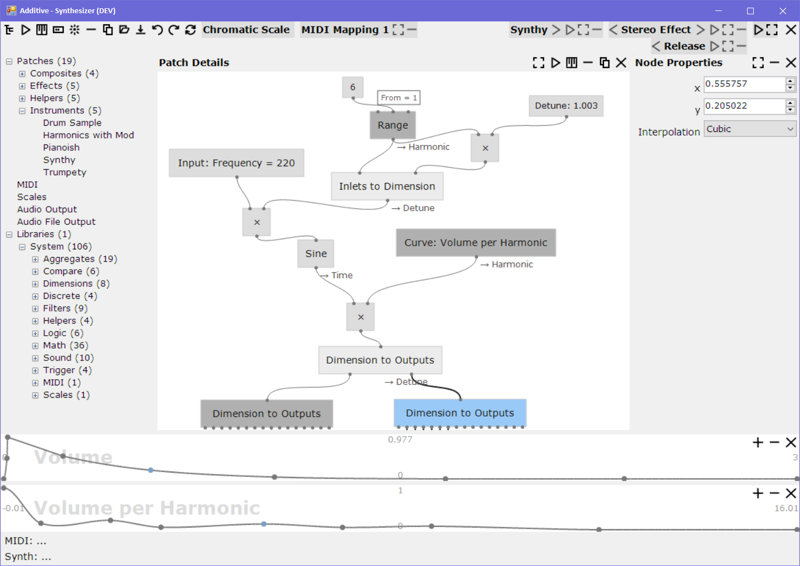
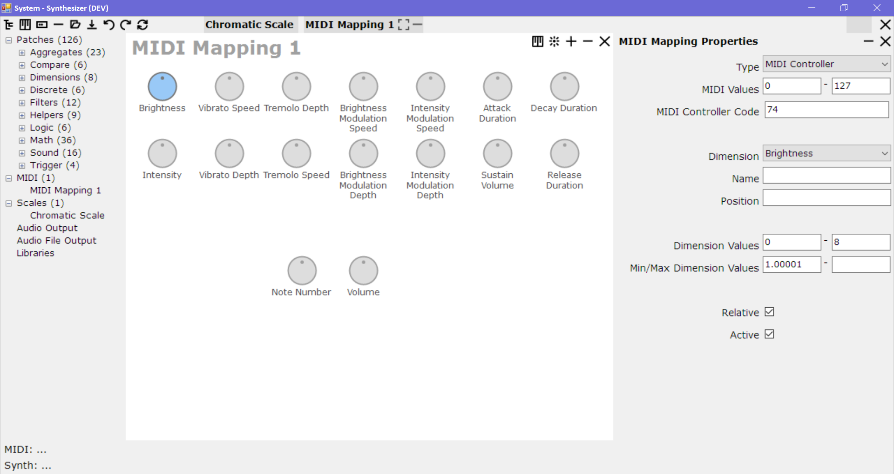

*JJ van Zon, 2022*

JJ.Synthesizer
==============

<h2>Contents</h2>

- [Intro](#intro)
- [Bugs](#bugs)
- [Technical Wishlist](#technical-wishlist)
- [Set Up Dev Env](#set-up-dev-env)
    - [Database](#database)
    - [JJ.Framework](#jjframework)
- [Quirks Checking Out Old Commits](#quirks-checking-out-old-commits)

Intro
------------

`JJ.Synthesizer` is software for making music.

The purpose is to connect a MIDI keyboard to it, and play while the program generates the sound for the notes you play. It supports certain types of synthesis, like additive, subtractive, sampling, ADSR, noise generator, filters, and effects like compression and envelope following.

It has been a pet project of mine for a few years between about 2015 and 2018. It has been in the ice box for a few years now, because of my health issues. I am now trying to get it to the public domain at least.

[Installer](https://github.com/jjvanzon/JJ.Synthesizer/releases/) | Requires SQL Server

Bugs
----

When I dropped this project out of my hands, a few [bugs](README2.MD#bugs) remained. Unfortunately I was not able to resolve these bugs yet. More shortcomings might be there, but *these* might make it musically as good as unusable:

- [Ticks when letting go of the keyboard key.](README2.MD#bug-1-ticks)
- [Delay on the notes after hitting the keyboard.](README2.MD#bug-2-note-delays)

Technical Wishlist
------------------

Not entirely proud of the many other little bugs that remained. Solution:  
[More Automated Testing?](README2.MD#technical-wishlist)

Set Up Dev Env
--------------

### Database

- Open the folder Database\SynthesizerDB
- You might a file there like "SynthesizerDB.zip".
- You could looki for the one last in the list sorted by name. That should be the latest database backup.
- The file can be unzipped and then restored in SQL Server with name "DEV_SaveTextDB".
- The database user name "dev" may be expected with password "dev".

-----

- In luck, no manual work after that may be needed.
- But it is possible that .sql files are listed after the Synthesizer backup file.
- Those may then be executed one by one, onto the restored SynthesizerDB, to get the database more up-to-date.

-----

- Some of the SQL files may indicate "RUN UTILITY".
- That indicates that the utility "JJ.Utilities.Synthesizer.DataMigration" might be run.
- That utility would be found when opening the Synthesizer.sln.
- Running it should show a window that allows executing a database migration step.
- The "RUN UTILITY" sql should have indicated *which step* to run.
- In an unfortunate case, it might be needed, to do a git checkout of a commit somewhere in history in order to run the utility. The commit to check out might be the one closest to the date indicated in the file name of the "RUN UTILITY" sql file.
- Sorry for a possible lack of elegance here.

### JJ.Framework

- Pre-release versions of `JJ.Framework` components may be used.
- Those are currently hosted in *Azure DevOps*:
- https://pkgs.dev.azure.com/jjvanzon/1de16010-421a-41a5-90f1-86e9513f2c5b/_packaging/JJs-Pre-Release-Package-Feed/nuget/v3/index.json
- Name: JJs-Pre-Release-Package-Feed
- It might require configuring *NuGet* in your dev environment to connect to this additional package source.

Quirks Checking Out Old Commits
-------------------------------

`JJ.Synthesizer` was once part of a larger code base. It was extracted to become a new Git repository with history in tact. Some quirks when checking out older history items, may have to do with that. The following may only be relevant when getting older commits from history (from before 2022-11-18).

- Commit messages:
    - May mention projects not part of the `JJ.Synthesizer` repo.
- Broken references to `JJ.Framework`:
    - `JJ.Framework` projects are no longer in the same code base.
    - It may help to try referencing the NuGet version of these depedencies.
    - Another option may be to clone the [JJ.Framework repository](https://github.com/jjvanzon/JJ.Framework) and fix the paths pointing to the `JJ.Framework` projects.
- References to other non-existent projects:
    - To fix this, try referencing the NuGet version of these depedencies.